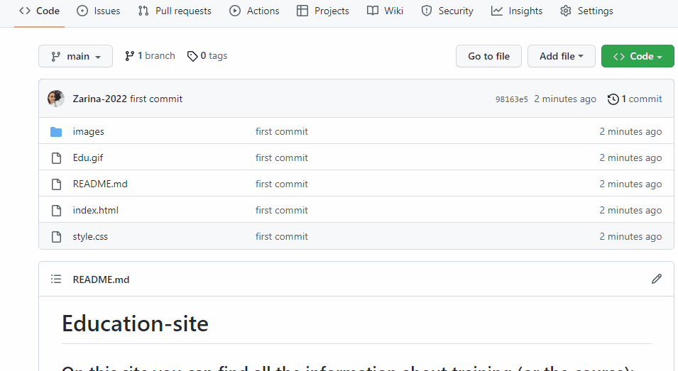

<h1> <b> Education-site </b> </h1>

<h2> On this site you can find all information about training (or the course):</h2>

<h2> registration, teachers, training topics, contact details, etc.</h2>

<h3> The coding languages and libraries I used while preparing this site are:</h3>

<b>1. HTML</b>

<b>2. <a href="https://www.bootstrapcdn.com/">Bootstrap</a> </b> - for responsive structures and styles.

<b>3.<a href="https://www.google.com/maps/@51.7635897,5.3246659,14z"> Google map </a></b>- to display map on my webpage.

<b>4. <a href="https://icons.getbootstrap.com/">Bootstrap icons</a></b> - to insert icons on my webpage.

<h4>Preview:</h4>

<h4>Download:</h4>

